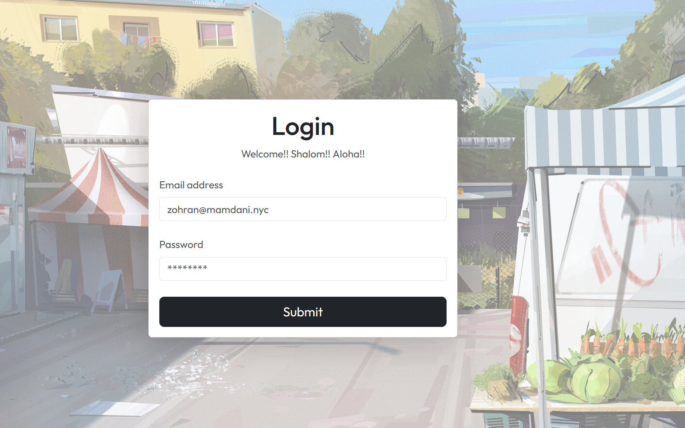
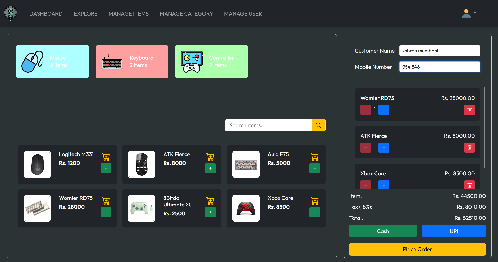
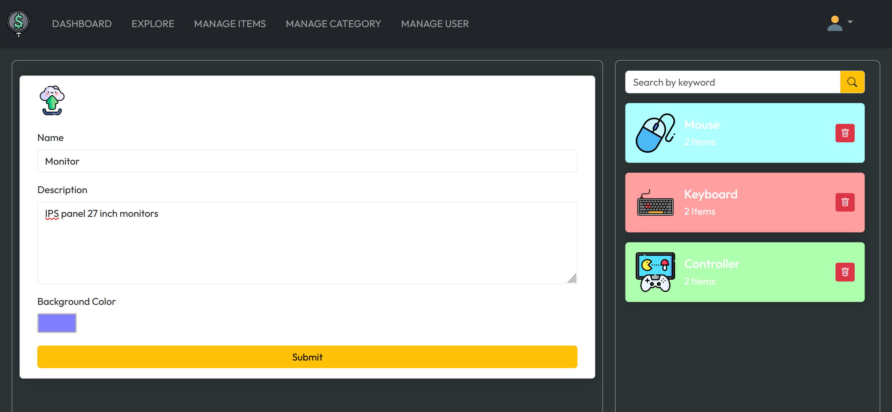
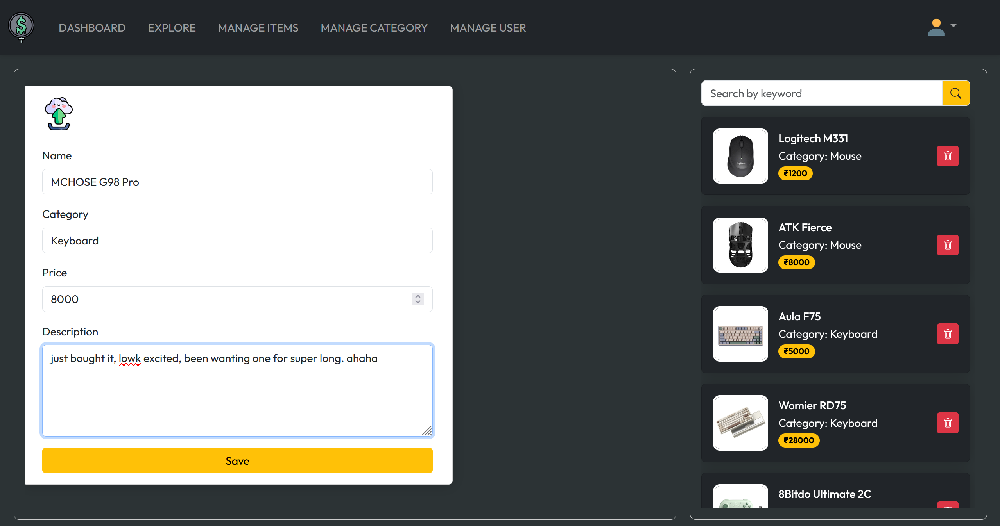
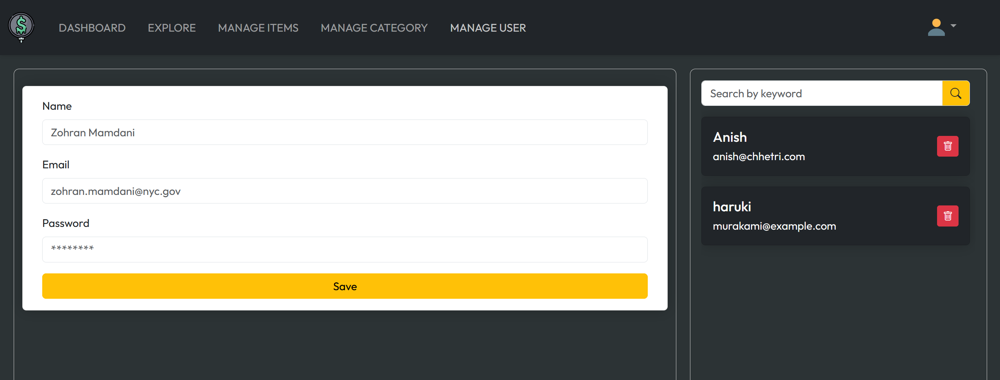

# Retail Billing System
Software where employees can add items from various categories to a cart which for the consumer. Admin can add category, items to respective categories and add or delete users.

## Tech Stack
- Spring Boot (Java)
- Vite (React.js)
- MySQL
- Amazon S3 bucket
- Razorpay payment gateway

<b>Note: </b>I followed this super cracked guy's 12 hour long YT video. Honestly, one of the best, in-depth builds I've done so far. Props to 'Engineer Talks with Bhushan'. Do look him up in youtube, bro has alot of killer projects.
Learned alot from this project, from setting up the MySQL server locally to setting up AWS. This project is incomplete, the dashboard page and the RazorPay gateway is pending. I need to create an acc and do KYC and what not, so I decided to stop till there.

Still one of the best projects, the dude deserves more glaze honestly. Learned alot of stuff with building the backend and frontend which I found really valuable.
The AWS free acc lasts 6 months, after that I will need to change the imageUrl route. Quickest work around would be the setup a gallery folder in root directory and change the url path to that.

Video - https://www.youtube.com/watch?v=_UNE39gZrV4&list=WL

## Demo

<h3>Login</h3>

<h3>Explore Page</h3>

<h4>Pages below are exclusively for Admin</h4>

<h3>Category Page</h3>

<h3>Items Page</h3>

<h3>User Page</h3>

